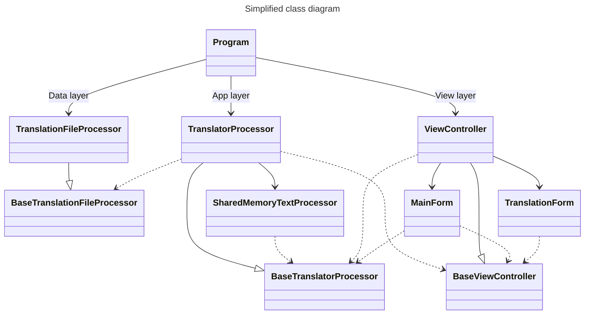

# MiniProjects
Public miniprojects

# Architecture
The complete diagram lies at the root of the project

```mermaid
---
title: Simplified class diagram
---
classDiagram

    Program-->TranslationFileProcessor : Data layer
    Program-->TranslatorProcessor : App layer
    Program-->ViewController : View layer

    TranslationFileProcessor--|>BaseTranslationFileProcessor

    TranslatorProcessor..>BaseTranslationFileProcessor
    TranslatorProcessor--|>BaseTranslatorProcessor
    TranslatorProcessor-->SharedMemoryTextProcessor
    SharedMemoryTextProcessor..>BaseTranslatorProcessor
    TranslatorProcessor..>BaseViewController   

    ViewController..>BaseTranslatorProcessor
    ViewController--|>BaseViewController
    ViewController-->MainForm
    ViewController-->TranslationForm
    MainForm..>BaseViewController
    MainForm..>BaseTranslatorProcessor
    TranslationForm..>BaseViewController
```
